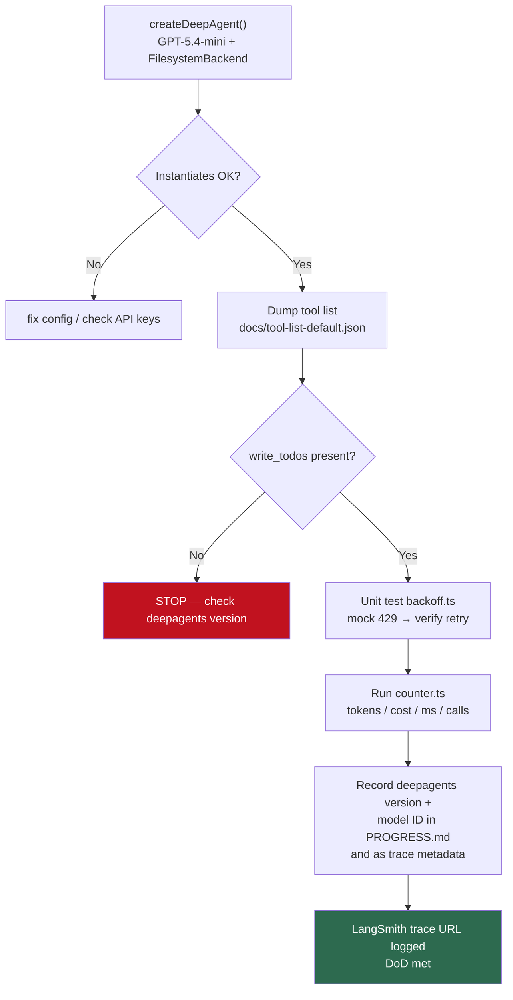
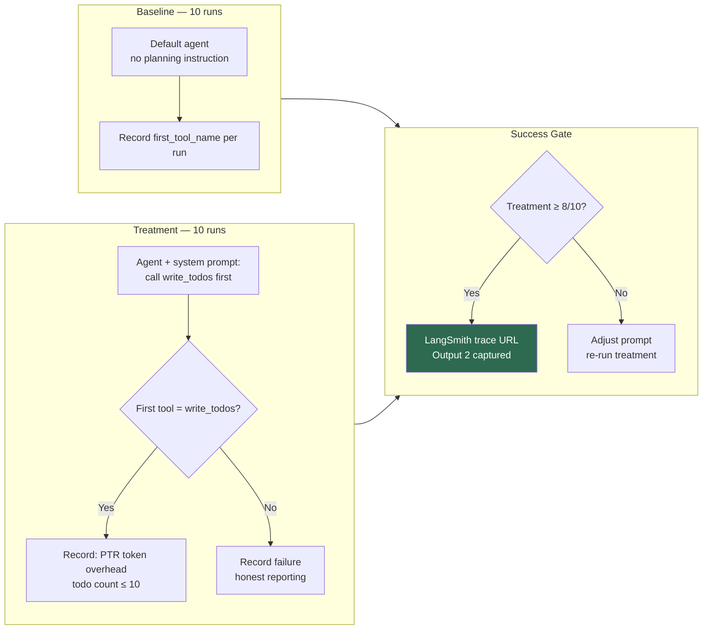
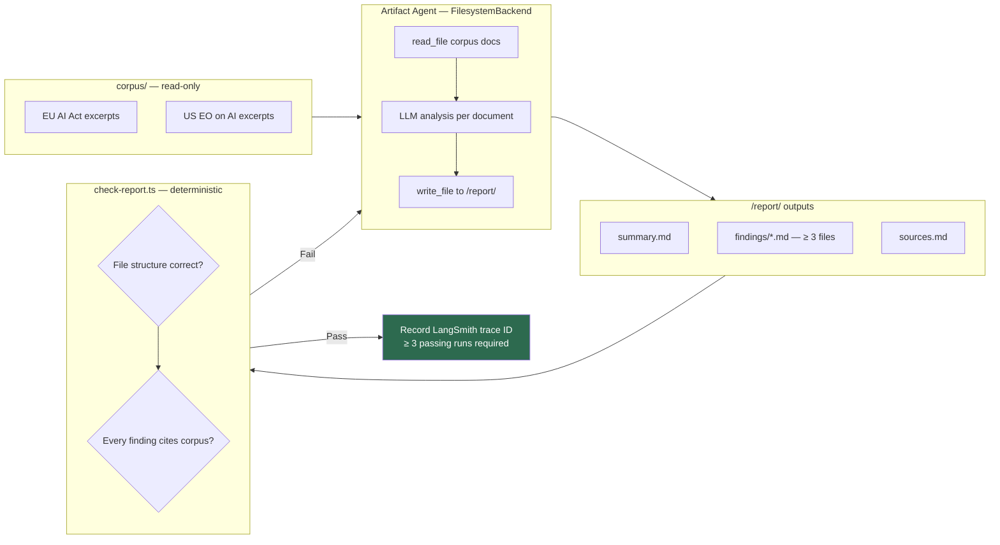

# Experiment Workflows — T-DA-01 through T-DA-03

## T-DA-01 — Scaffold + Reality Check

```mermaid
flowchart TD
    A["createDeepAgent()\nGPT-5.4-mini + FilesystemBackend"] --> B{Instantiates OK?}
    B -->|No| FIX["fix config / check API keys"]
    B -->|Yes| D["Dump tool list\ndocs/tool-list-default.json"]
    D --> E{write_todos present?}
    E -->|No| ERR["STOP — check deepagents version"]
    E -->|Yes| F["Unit test backoff.ts\nmock 429 → verify retry"]
    F --> G["Run counter.ts\ntokens / cost / ms / calls"]
    G --> H["Record deepagents version +\nmodel ID in PROGRESS.md\nand as trace metadata"]
    H --> DONE["LangSmith trace URL logged\nDoD met"]

    style DONE fill:#2d6a4f,color:#fff
    style ERR fill:#c1121f,color:#fff
```

## T-DA-02 — Planning-First (Output 2)

```mermaid
flowchart LR
    subgraph BL["Baseline — 10 runs"]
        B1["Default agent\nno planning instruction"]
        B2["Record first_tool_name per run"]
        B1 --> B2
    end

    subgraph TR["Treatment — 10 runs"]
        T1["Agent + system prompt:\ncall write_todos first"]
        T2{First tool = write_todos?}
        T3["Record: PTR token overhead\ntodo count ≤ 10"]
        T4["Record failure\nhonest reporting"]
        T1 --> T2
        T2 -->|Yes| T3
        T2 -->|No| T4
    end

    subgraph SG["Success Gate"]
        G{Treatment ≥ 8/10?}
        PASS["LangSmith trace URL\nOutput 2 captured"]
        TUNE["Adjust prompt\nre-run treatment"]
        G -->|Yes| PASS
        G -->|No| TUNE
    end

    BL --> SG
    TR --> SG

    style PASS fill:#2d6a4f,color:#fff
```

## T-DA-03 — Artifact Agent (Output 1)

```mermaid
flowchart LR
    subgraph C["corpus/ — read-only"]
        C1["EU AI Act excerpts"]
        C2["US EO on AI excerpts"]
    end

    subgraph AG["Artifact Agent — FilesystemBackend"]
        AG1["read_file corpus docs"]
        AG2["LLM analysis per document"]
        AG3["write_file to /report/"]
        AG1 --> AG2 --> AG3
    end

    subgraph RP["/report/ outputs"]
        R1["summary.md"]
        R2["findings/*.md — ≥ 3 files"]
        R3["sources.md"]
    end

    subgraph CK["check-report.ts — deterministic"]
        CK1{File structure correct?}
        CK2{Every finding cites corpus?}
        CK1 --> CK2
    end

    C --> AG
    AG --> RP
    RP --> CK
    CK -->|Pass| OK["Record LangSmith trace ID\n≥ 3 passing runs required"]
    CK -->|Fail| AG

    style OK fill:#2d6a4f,color:#fff
```
